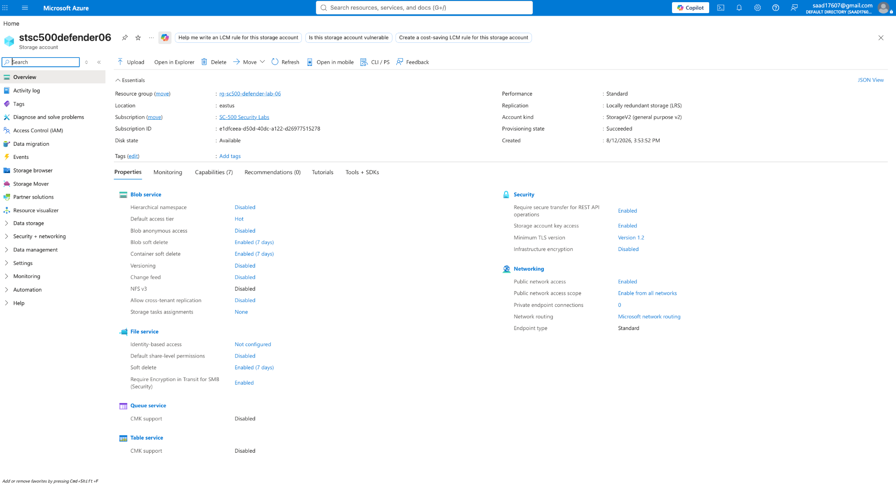
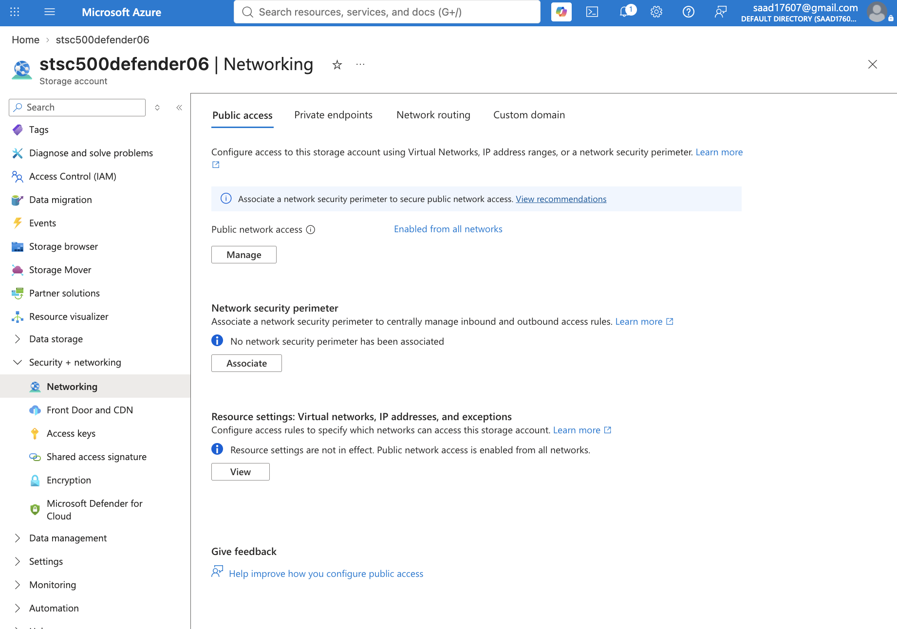
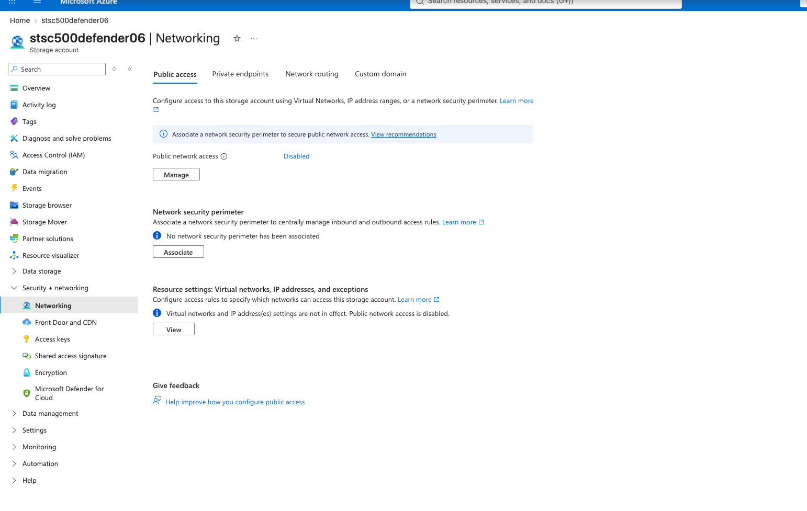

# SC-500 Lab 6: Microsoft Defender for Cloud Security Posture Management

Hands-on Azure security lab demonstrating Cloud Security Posture Management (CSPM), storage security configuration, risk identification, and remediation using Microsoft Defender for Cloud.

## Objective

The objective of this lab was to deploy an Azure resource, review its security posture, identify an insecure network configuration, and apply remediation to reduce the resource's attack surface.

## Environment

- Microsoft Azure
- Microsoft Defender for Cloud
- Azure Storage
- Azure Resource Groups
- Azure Networking
- SC-500 Security Labs subscription

## Lab Configuration

A dedicated resource group and Azure Storage account were created for the lab:

- Resource Group: `rg-sc500-defender-lab-06`
- Storage Account: `stsc500defender06`
- Region: `East US`
- Performance: `Standard`
- Replication: `Locally-redundant storage (LRS)`
- Secure transfer required: `Enabled`
- Minimum TLS version: `1.2`
- Blob anonymous access: `Disabled`
- Blob soft delete: `Enabled`
- Container soft delete: `Enabled`

## Security Analysis

The storage account was initially configured with public network access enabled from all networks.

This configuration increases the externally reachable attack surface of the storage account. In a production environment, storage resources should generally use the most restrictive network configuration that satisfies the application's connectivity requirements.

### Initial Storage Security Configuration

The storage account was configured with several baseline security controls, including secure transfer, TLS 1.2, disabled anonymous blob access, and soft-delete protection.

## Network Exposure

Public network access was initially enabled from all networks.

This configuration allows the storage account's public endpoint to be reachable without restricting connectivity to selected networks.

## Remediation

To reduce unnecessary exposure, public network access was disabled.

After remediation, inbound access through the storage account's public endpoint was disabled.

## Security Outcome

The lab demonstrated the process of:

1. Deploying an Azure resource for security testing.
2. Reviewing storage security controls.
3. Identifying unnecessary public network exposure.
4. Applying a security-hardening change.
5. Verifying that public network access was disabled.
6. Documenting the configuration and remediation with technical evidence.

## Skills Demonstrated

- Microsoft Defender for Cloud
- Cloud Security Posture Management (CSPM)
- Azure Storage security
- Azure network security
- Attack surface reduction
- Security configuration review
- Cloud resource hardening
- Risk identification and remediation
- Azure Portal administration
- Security evidence documentation

## Key Takeaway

Cloud security posture management involves more than identifying vulnerabilities. It also requires evaluating resource configurations, understanding exposure, prioritizing risk, and applying appropriate remediation.

In this lab, unnecessary public network exposure was identified and removed, demonstrating a practical Azure security-hardening workflow.
