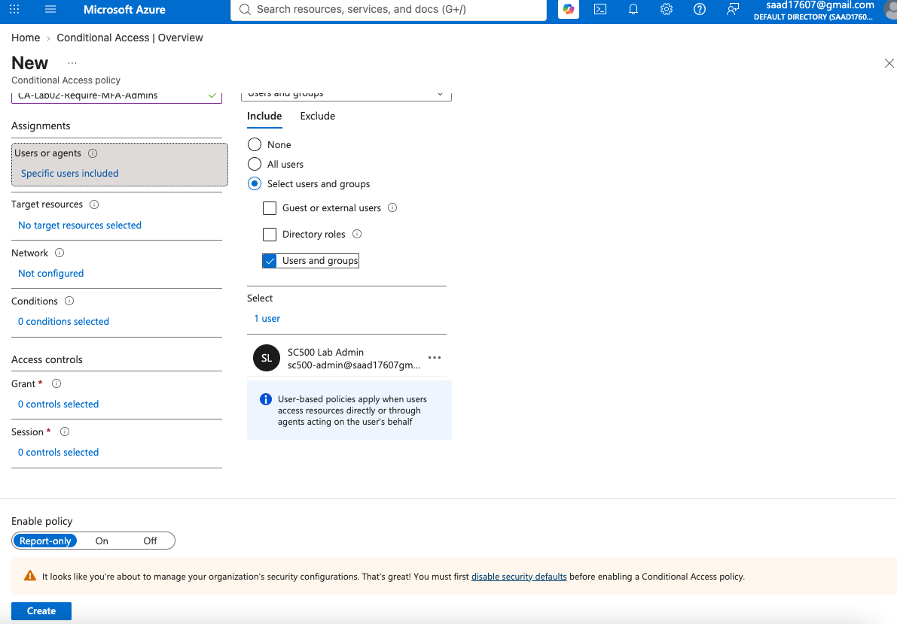
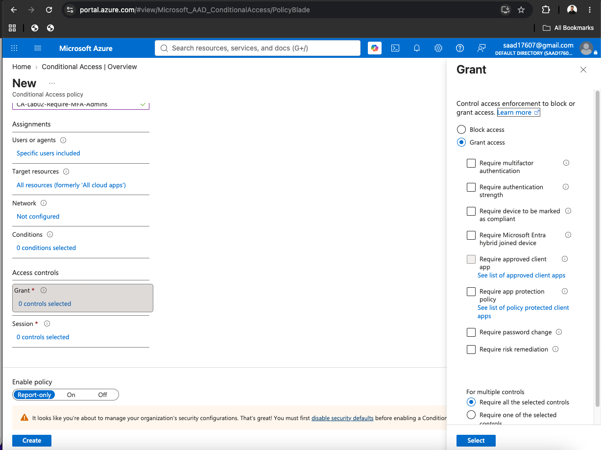
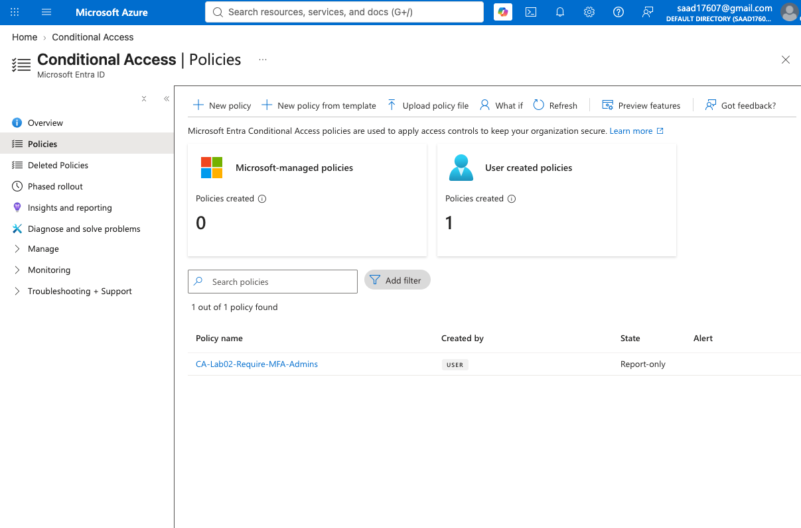
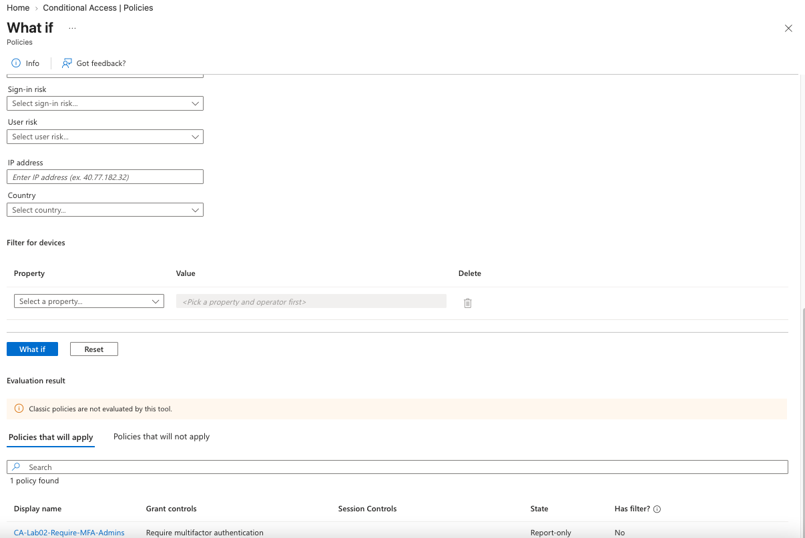
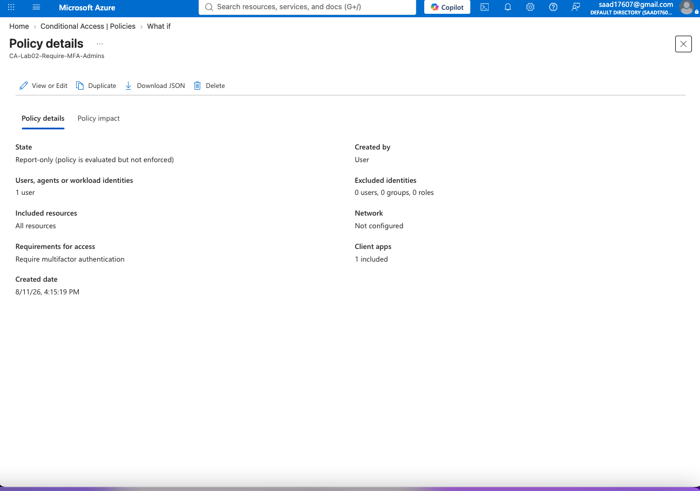

# Lab 02 – Conditional Access: Require MFA for Administrative Access

## Objective

Implement and validate a Microsoft Entra ID Conditional Access policy that requires multifactor authentication (MFA) for an administrative account.

This lab demonstrates hands-on experience configuring identity-based security controls using Microsoft Entra ID and validating policy behavior before enforcement.

## Environment

- Microsoft Azure
- Microsoft Entra ID
- Microsoft Entra ID P2
- Conditional Access
- Administrative test account: `SC500 Lab Admin`
- Policy mode: Report-only

## Lab Scenario

Administrative accounts are high-value targets because they have elevated permissions within a cloud environment.

The objective of this lab was to create a Conditional Access policy that requires MFA when the selected administrative account accesses cloud resources.

The policy was initially deployed in **Report-only** mode so its impact could be evaluated before enforcement.

## Implementation

### 1. Created an Administrative Test Account

A dedicated test account named:

`SC500 Lab Admin`

was created in Microsoft Entra ID and configured for administrative testing.

This allows security controls to be tested without using the primary tenant administrator account.

### 2. Configured Conditional Access Policy

Created the following Conditional Access policy:

`CA-Lab02-Require-MFA-Admins`

The policy was configured with:

- **Identity:** SC500 Lab Admin
- **Target resources:** All resources
- **Grant control:** Require multifactor authentication
- **Policy state:** Report-only

### 3. Required Multifactor Authentication

Under **Access controls → Grant**, the policy was configured to:

`Require multifactor authentication`

This provides an additional authentication layer beyond username and password.

### 4. Used Report-Only Deployment

The policy was initially configured in:

`Report-only`

Report-only mode allows administrators to evaluate how a Conditional Access policy would affect authentication attempts without actively enforcing the policy.

This is useful for identifying potential access problems before production deployment.

## Validation

The Microsoft Entra **What If** tool was used to simulate a sign-in involving the SC500 Lab Admin account.

The evaluation showed:

`CA-Lab02-Require-MFA-Admins`

under **Policies that will apply**.

The resulting grant control was:

`Require multifactor authentication`

This confirmed that the Conditional Access policy was correctly scoped and would require MFA if enforcement were enabled.

## Policy Configuration Summary

| Setting | Configuration |
|---|---|
| Policy | CA-Lab02-Require-MFA-Admins |
| Identity | SC500 Lab Admin |
| Target Resources | All resources |
| Grant Control | Require multifactor authentication |
| Deployment Mode | Report-only |
| Validation | Conditional Access What If tool |

## Security Concepts Demonstrated

This lab demonstrates practical experience with:

- Microsoft Entra ID
- Conditional Access
- Multifactor authentication (MFA)
- Identity and access management (IAM)
- Administrative account protection
- Zero Trust identity controls
- Policy scoping
- Least privilege security practices
- Report-only policy deployment
- Conditional Access policy validation

## Security Engineering Takeaway

Conditional Access provides a policy-based approach for controlling access to cloud resources based on identity and authentication requirements.

Requiring MFA for privileged identities reduces the risk associated with compromised passwords and supports Zero Trust principles by requiring additional verification before granting access.

Deploying new policies in **Report-only** mode provides a safer implementation approach because administrators can evaluate policy impact before enforcement.

## Evidence

### 1. Conditional Access User Assignment

The Conditional Access policy was scoped to the dedicated **SC500 Lab Admin** account.

### 2. MFA Grant Control

The policy was configured to require **multifactor authentication (MFA)** as the access control.

### 3. Conditional Access Policy Created

The `CA-Lab02-Require-MFA-Admins` policy was successfully created and deployed in **Report-only** mode.

### 4. What If Validation

Microsoft Entra's **What If** tool confirmed that the Conditional Access policy would apply to the simulated sign-in and require MFA.

### 5. Final Policy Configuration

The final policy configuration confirms:

- Target: SC500 Lab Admin
- Resources: All resources
- Access requirement: Multifactor authentication
- State: Report-only

