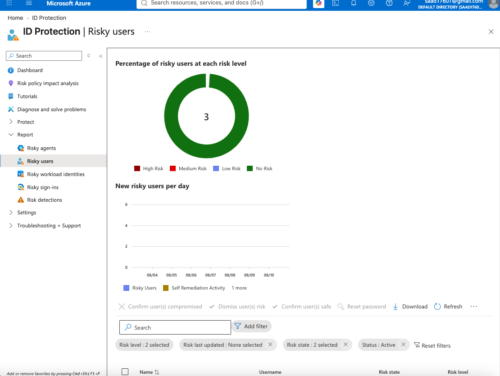
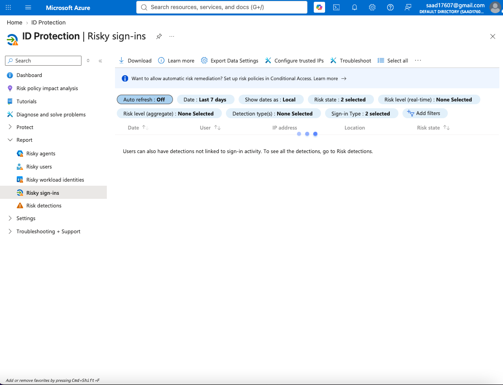
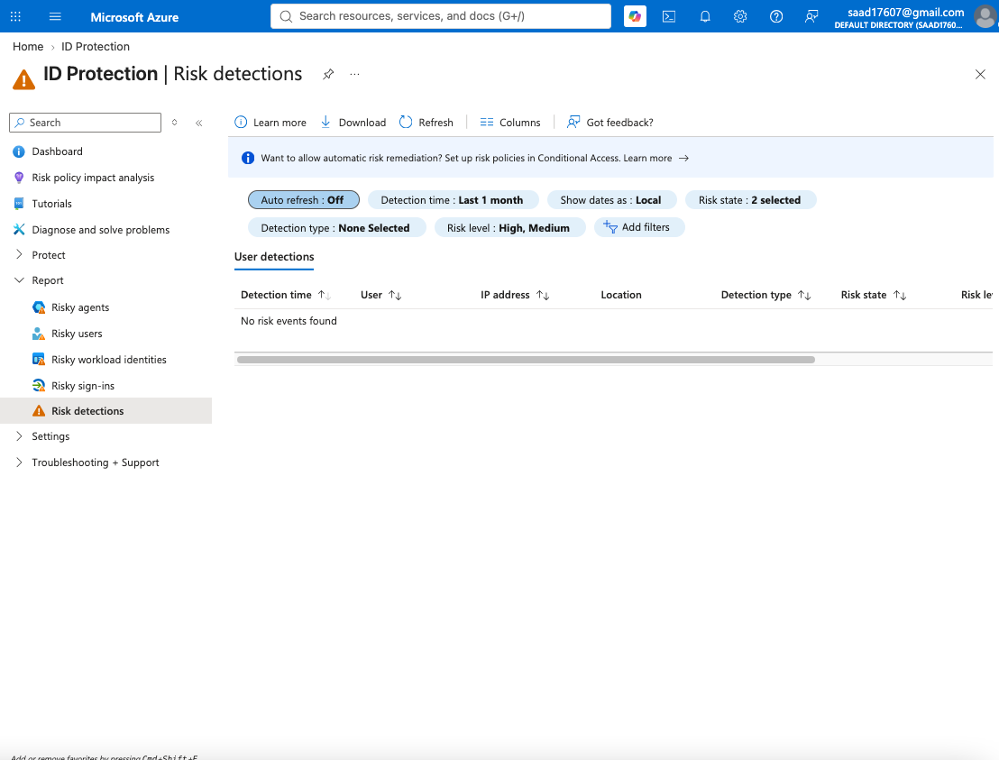
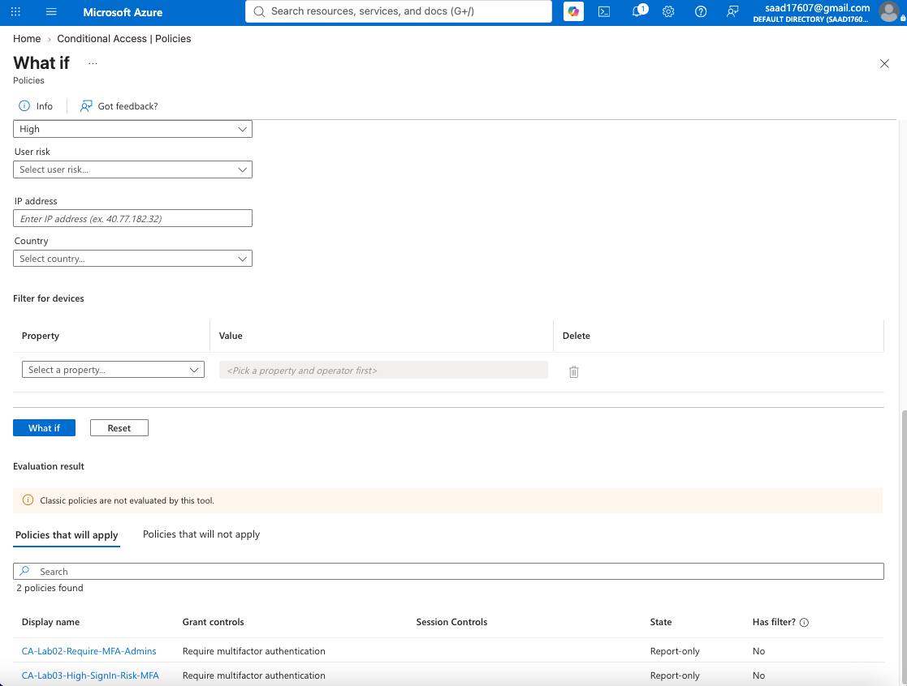
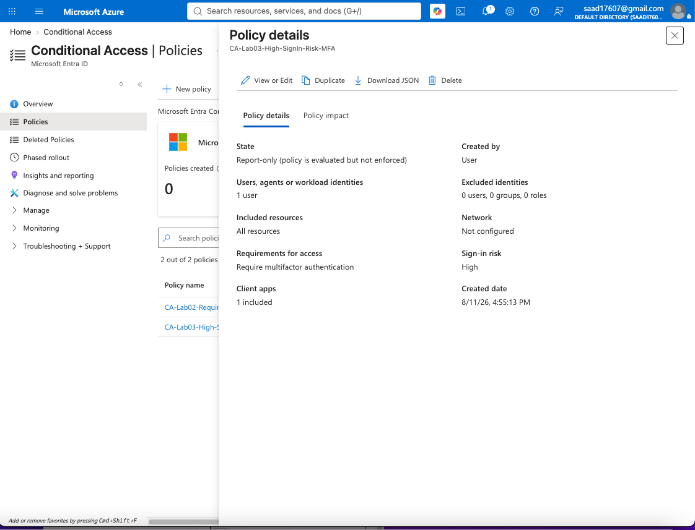

# Lab 03 – Identity Protection: Risk-Based Conditional Access

## Objective

Implement and validate a risk-based Conditional Access policy using Microsoft Entra ID Protection.

This lab demonstrates how identity risk signals can be used to dynamically require multifactor authentication (MFA) when Microsoft Entra ID detects a high-risk sign-in.

---

## Environment

- Microsoft Azure
- Microsoft Entra ID
- Microsoft Entra ID Protection
- Conditional Access
- Microsoft Entra ID P2
- Administrative test account

---

## Scenario

Organizations need stronger authentication controls when suspicious authentication activity is detected.

Instead of requiring the same authentication controls for every sign-in, Microsoft Entra ID Protection can provide risk signals to Conditional Access.

For this lab, I configured a policy that:

- Targets a selected administrative test user
- Applies to all cloud resources
- Detects **High sign-in risk**
- Requires **Multifactor Authentication**
- Operates in **Report-only mode**
- Is validated using the Conditional Access **What If** tool

---

## Step 1 – Review Microsoft Entra ID Protection

I accessed the Microsoft Entra ID Protection dashboard to review identity-risk monitoring capabilities.

Identity Protection provides visibility into:

- Risky users
- Risky sign-ins
- Risk detections
- Identity-based security events

---

## Step 2 – Review Risky Sign-ins

I reviewed the Risky sign-ins dashboard to understand where Microsoft Entra surfaces potentially compromised authentication attempts.

Risky sign-ins can be evaluated using signals such as unusual authentication behavior, suspicious IP activity, and other identity-related indicators.

---

## Step 3 – Review Risk Detections

I reviewed the Risk detections section of Microsoft Entra ID Protection.

Risk detections provide security teams with visibility into events that Microsoft identifies as potentially suspicious.

---

## Step 4 – Configure Risk-Based Conditional Access

I created the following Conditional Access policy:

**Policy Name**

`CA-Lab03-High-SignIn-Risk-MFA`

### Assignments

**User**

Administrative lab test account

**Target Resources**

All resources

### Conditions

**Sign-in Risk**

High

### Grant Control

Require multifactor authentication

### Policy State

Report-only

Using Report-only mode allows the policy to be evaluated without immediately enforcing the control against users.

---

## Step 5 – Validate the Policy with What If

I used the Conditional Access **What If** tool to simulate a high-risk authentication event.

The simulation confirmed that:

`CA-Lab03-High-SignIn-Risk-MFA`

would apply and require multifactor authentication when the configured high-risk sign-in condition is met.

---

## Step 6 – Verify Final Policy Configuration

The final policy configuration confirmed:

| Configuration | Setting |
|---|---|
| Policy | CA-Lab03-High-SignIn-Risk-MFA |
| User scope | Selected administrative test user |
| Resources | All resources |
| Sign-in risk | High |
| Grant control | Require multifactor authentication |
| Enforcement | Report-only |

---

## Security Engineering Takeaway

Risk-based Conditional Access provides adaptive identity protection by changing authentication requirements based on the risk associated with a sign-in.

Instead of relying solely on static access rules, security teams can combine Microsoft Entra ID Protection risk signals with Conditional Access controls to respond dynamically to suspicious authentication activity.

Requiring MFA for high-risk sign-ins helps reduce the likelihood that compromised credentials alone can provide access to cloud resources.

Using **Report-only mode** before enforcement also allows security engineers to evaluate policy impact and reduce the risk of unintended access disruptions.

---

## Skills Demonstrated

- Microsoft Entra ID Protection
- Identity risk monitoring
- Risky user investigation
- Risky sign-in analysis
- Risk detection analysis
- Conditional Access
- Risk-based access policies
- Multifactor authentication
- Policy impact testing
- What If analysis
- Zero Trust identity security
