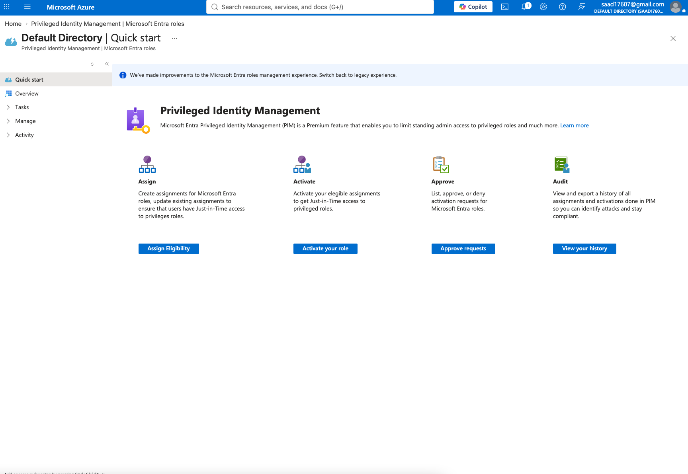
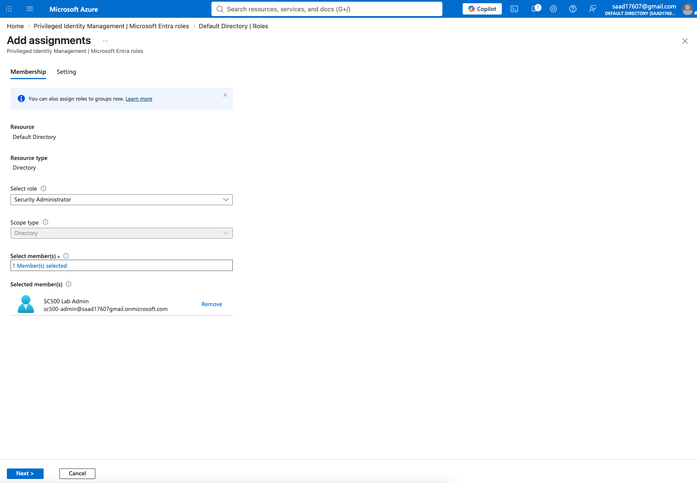
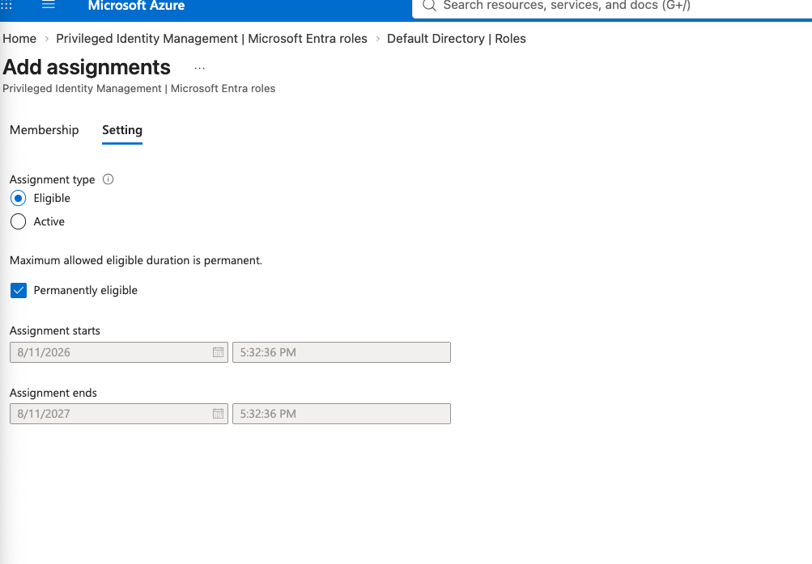
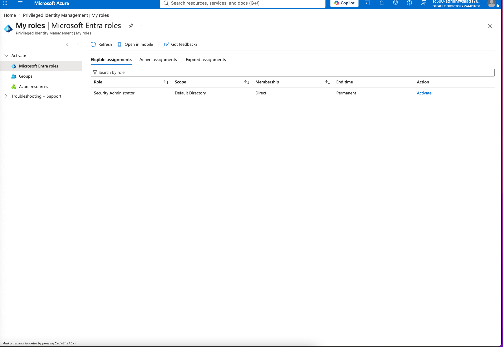
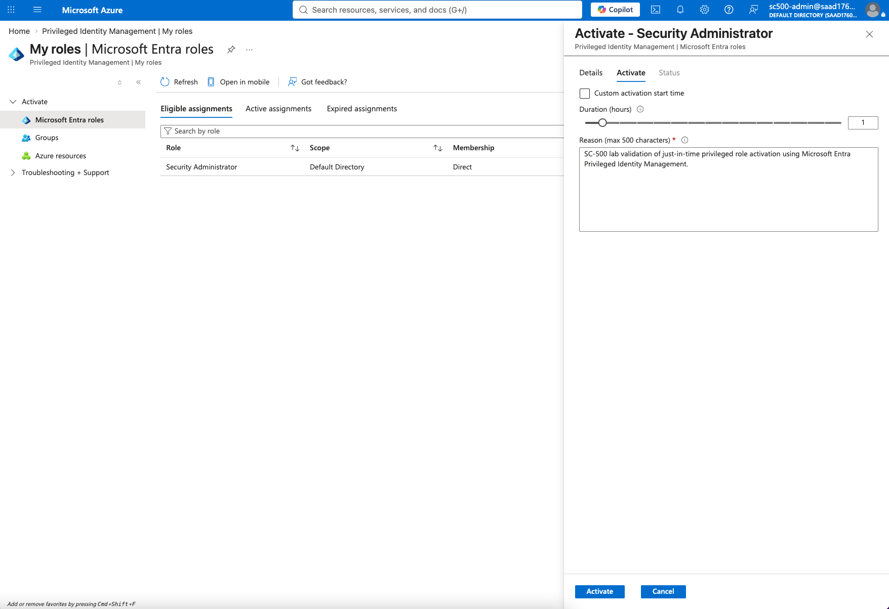
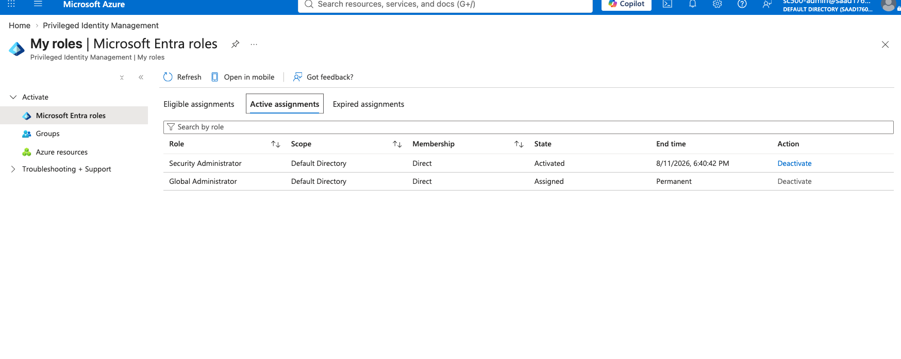
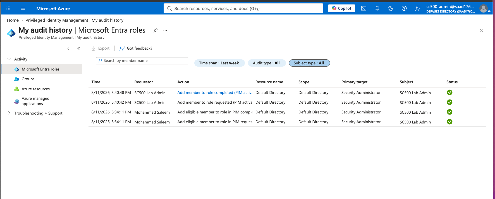

# Lab 04 – Privileged Identity Management: Just-in-Time Administrative Access

## Objective

Implement and validate Microsoft Entra Privileged Identity Management (PIM) to provide Just-in-Time (JIT) administrative access.

This lab demonstrates how privileged roles can be assigned as **eligible** rather than permanently active, reducing standing administrative privilege and improving security through time-bound elevation.

---

## Environment

- Microsoft Azure
- Microsoft Entra ID
- Microsoft Entra Privileged Identity Management
- Microsoft Entra ID P2
- Security Administrator role
- Dedicated lab administrator account

---

## Scenario

Privileged administrative accounts are high-value targets.

Instead of permanently assigning elevated permissions, Microsoft Entra Privileged Identity Management can be used to make users **eligible** for privileged roles and require them to activate those roles only when needed.

For this lab, I configured the SC500 Lab Admin account to be eligible for the **Security Administrator** role and then activated the role temporarily using PIM.

---

## Step 1 – Review Privileged Identity Management

I accessed Microsoft Entra Privileged Identity Management and reviewed the available privileged access workflows.

PIM provides capabilities for:

- Eligible role assignments
- Just-in-Time role activation
- Approval workflows
- Privileged access auditing
- Time-bound administrative access

---

## Step 2 – Select the Security Administrator Role

I selected the built-in **Security Administrator** Microsoft Entra role.

The role was assigned to the dedicated SC500 Lab Admin account at the directory scope.

---

## Step 3 – Configure the Role as Eligible

The assignment was configured as:

- **Assignment type:** Eligible
- **Scope:** Default Directory
- **Member:** SC500 Lab Admin
- **Eligibility:** Permanent

The key security distinction is that the account does not continuously hold active Security Administrator privileges.

Instead, it is eligible to activate the role when privileged access is required.

---

## Step 4 – Verify Eligible Role Assignment

After the assignment was created, the SC500 Lab Admin account displayed the **Security Administrator** role under Eligible assignments.

The account could then request temporary activation when elevated access was required.

---

## Step 5 – Request Just-in-Time Activation

The Security Administrator role was activated through PIM using:

- **Activation duration:** 1 hour
- **Custom start time:** Disabled
- **Business justification:** SC-500 lab validation of Just-in-Time privileged role activation

Using a short activation period limits the amount of time elevated privileges remain available.

---

## Step 6 – Verify Temporary Privileged Access

After activation, the Security Administrator role appeared under **Active assignments**.

The activation showed:

- **Role:** Security Administrator
- **State:** Activated
- **Scope:** Default Directory
- **End time:** Time-bound
- **Action:** Deactivate

This confirms that elevated privileges were successfully activated temporarily rather than permanently assigned.

---

## Step 7 – Review PIM Audit History

Microsoft Entra PIM recorded both the eligible assignment and activation workflow.

The audit history showed:

- Eligible role assignment requested
- Eligible role assignment completed
- PIM activation requested
- PIM activation completed
- Successful status for each privileged access event

---

## Configuration Summary

| Configuration | Setting |
|---|---|
| Privileged role | Security Administrator |
| User | SC500 Lab Admin |
| Scope | Default Directory |
| Assignment type | Eligible |
| Activation model | Just-in-Time |
| Activation duration | 1 hour |
| Audit logging | Enabled through PIM |
| Privilege state | Temporary activation |

---

## Security Engineering Takeaway

Privileged Identity Management reduces the security risk created by permanently active administrative accounts.

By assigning privileged roles as **eligible**, organizations can reduce standing privilege and require administrators to explicitly activate elevated permissions only when needed.

Time-bound activation also reduces the attack window available to compromised privileged identities.

PIM supports Zero Trust and least-privilege principles through:

- Just-in-Time administrative access
- Time-limited privilege elevation
- Privileged access auditing
- Role activation tracking
- Reduced standing administrative permissions

In production environments, highly privileged roles such as Global Administrator should be tightly controlled, monitored, and where appropriate managed through PIM instead of remaining permanently active.

---

## Skills Demonstrated

- Microsoft Entra Privileged Identity Management
- Privileged Access Management
- Just-in-Time access
- Microsoft Entra administrative roles
- Eligible role assignments
- Privileged role activation
- Time-bound administrative access
- Least privilege
- Zero Trust
- Privileged access auditing
- Microsoft Entra ID P2
