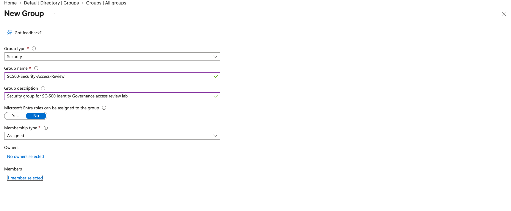
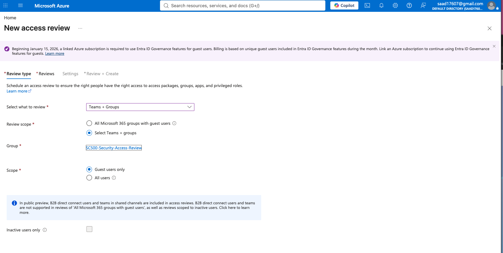
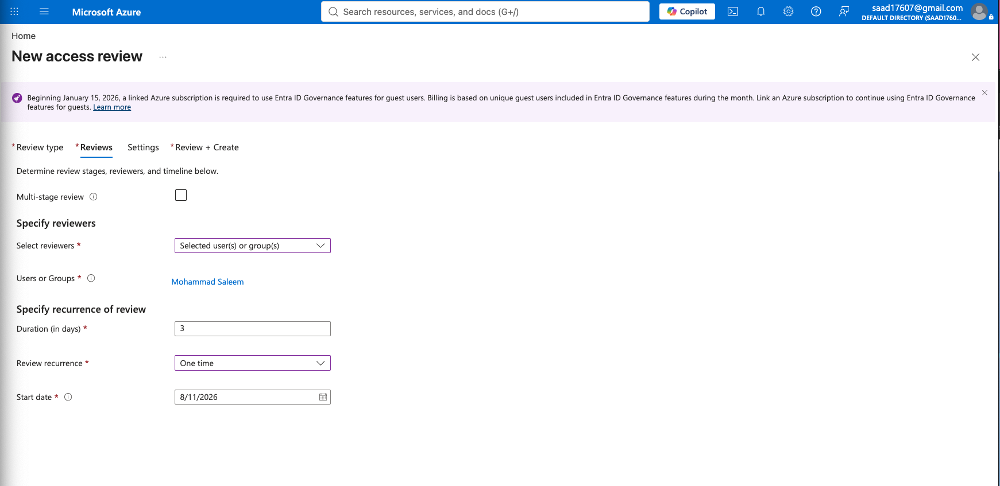
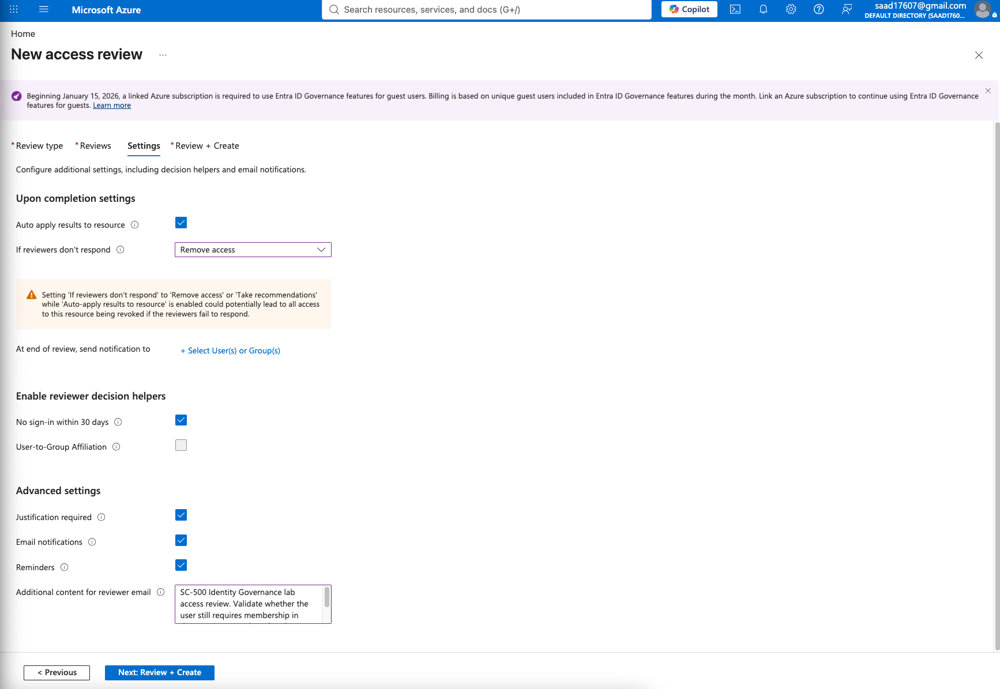
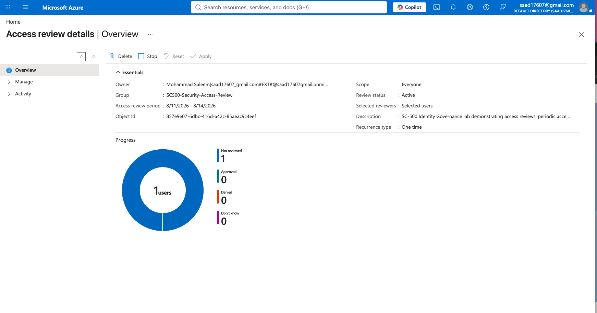
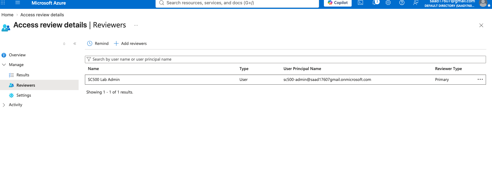
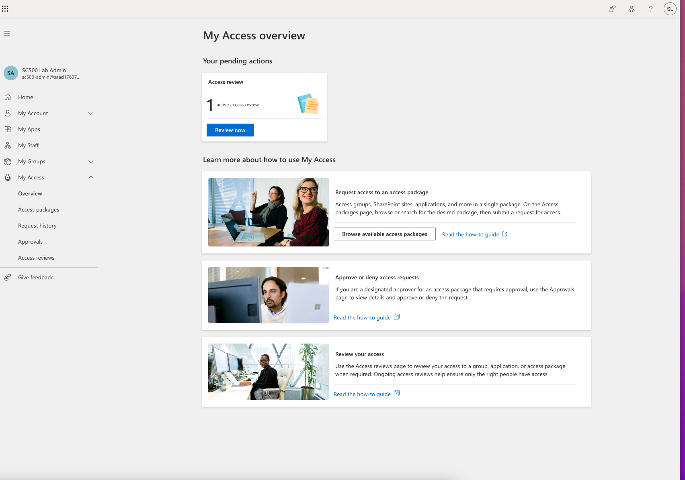
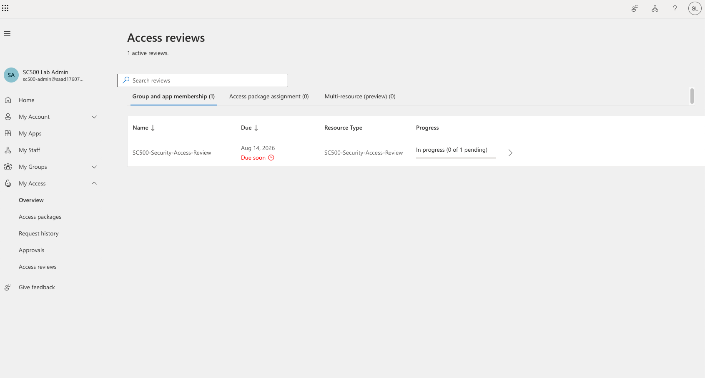
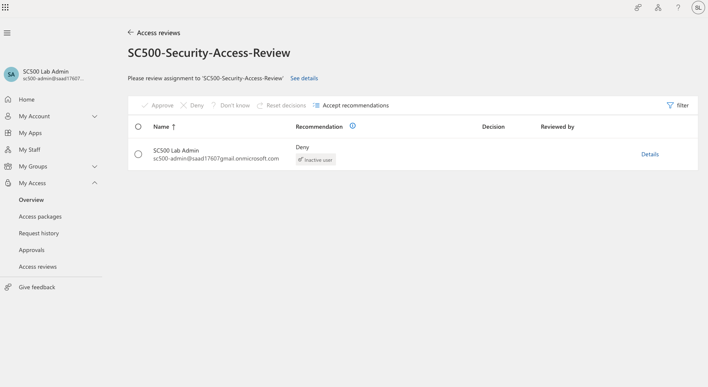
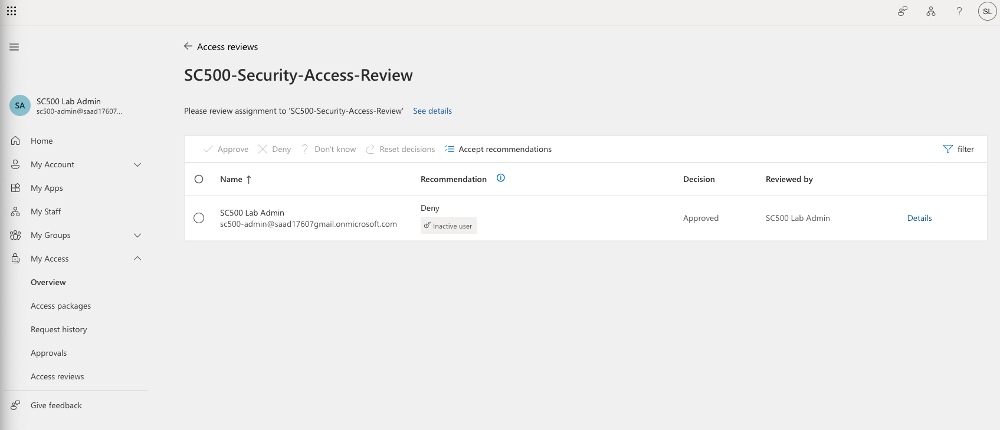

# SC-500 Lab 5: Microsoft Entra ID Access Reviews

## Objective

The objective of this lab was to gain hands-on experience with **Microsoft Entra ID Identity Governance** by configuring and performing an **Access Review**.

Access Reviews help organizations periodically verify whether users should continue to have access to groups, applications, and other organizational resources.

This lab demonstrates practical experience with:

- Microsoft Entra ID Identity Governance
- Access Reviews
- Security Groups
- Identity and Access Management (IAM)
- User Access Validation
- Reviewer Configuration
- Access Recommendations
- Access Governance
- Least Privilege
- Automated Access Management

---

## Lab Environment

**Platform:** Microsoft Azure / Microsoft Entra ID

**Feature:** Microsoft Entra ID Identity Governance – Access Reviews

**Security Group:**

`SC500-Security-Access-Review`

**Test User:**

`SC500 Lab Admin`

**Reviewer:**

`SC500 Lab Admin`

**Review Type:**

One-time Access Review

---

# Lab Implementation

## 1. Created Security Group

I created a Microsoft Entra ID security group named:

`SC500-Security-Access-Review`

The group was configured with:

- Group Type: Security
- Membership Type: Assigned
- Microsoft Entra roles assignable to group: No
- Test user added as a member

This group served as the resource being evaluated during the Access Review.

### Evidence

---

## 2. Configured the Access Review

Using **Microsoft Entra ID Identity Governance**, I created a new Access Review for the security group.

The review was configured to evaluate membership of:

`SC500-Security-Access-Review`

The review scope was configured to evaluate users associated with the selected group.

### Evidence

---

## 3. Configured the Reviewer

The Access Review was configured with a designated reviewer.

The lab administrator account was selected as the reviewer so that the account could evaluate whether the user should continue to have access to the security group.

This demonstrates how organizations can assign responsibility for periodic access certification.

### Evidence

---

## 4. Configured Access Review Settings

The Access Review was configured with governance controls designed to automate and strengthen the review process.

Settings included:

- Auto-apply results to resource
- Remove access if reviewers do not respond
- Reviewer decision helpers enabled
- No sign-in within 30 days enabled
- Justification required
- Email notifications enabled
- Review reminders enabled

These controls demonstrate how Microsoft Entra ID can automate identity governance and reduce unnecessary access.

### Evidence

---

## 5. Activated the Access Review

After completing the configuration, the Access Review was created and became active.

The Access Review dashboard displayed:

- Review status: Active
- Selected group
- Review period
- Selected reviewer
- Number of users awaiting review
- Approved users
- Denied users
- Unknown decisions

This dashboard provides administrators with centralized visibility into the status of an access certification campaign.

### Evidence

---

## 6. Verified Reviewer Assignment

I verified that the `SC500 Lab Admin` account was successfully configured as the primary reviewer.

The reviewer was responsible for evaluating whether the user should maintain membership in the security group.

### Evidence

---

## 7. Accessed Microsoft My Access

I signed into the Microsoft **My Access** portal using the designated reviewer account.

The portal displayed an active Access Review requiring action.

This demonstrates the end-user reviewer experience rather than only the administrative configuration experience.

### Evidence

---

## 8. Opened the Pending Access Review

From Microsoft My Access, I opened the:

`SC500-Security-Access-Review`

The review showed the account awaiting an access decision.

The reviewer could choose to:

- Approve
- Deny
- Select "Don't know"
- Accept Microsoft's recommendation

### Evidence

---

## 9. Evaluated Microsoft's Access Recommendation

Microsoft Entra ID generated a recommendation to:

`Deny`

The recommendation was associated with the account being identified as an **inactive user**.

This demonstrates the use of identity signals to assist reviewers when making access governance decisions.

Rather than blindly accepting the recommendation, the reviewer can evaluate whether access is still justified based on business requirements.

### Evidence

---

## 10. Completed the Access Review Decision

For the purposes of the lab, I reviewed the recommendation and selected:

`Approve`

The review then displayed:

- Decision: Approved
- Reviewed by: SC500 Lab Admin

This confirmed that the Access Review workflow was functioning successfully from configuration through reviewer decision.

### Evidence

---

# Security Concepts Demonstrated

## Identity Governance

Access Reviews provide organizations with a structured method for periodically validating user access to resources.

This helps prevent unnecessary permissions from remaining active indefinitely.

---

## Least Privilege

Access should only remain assigned when there is a legitimate business requirement.

Periodic Access Reviews help organizations enforce the **Principle of Least Privilege** by identifying accounts that may no longer require access.

---

## Access Certification

The lab demonstrated an access certification lifecycle:

**User receives access**

↓

**Access Review is created**

↓

**Reviewer evaluates access**

↓

**Microsoft Entra provides recommendation**

↓

**Reviewer approves or denies access**

↓

**Access decision is recorded**

---

## Automated Identity Governance

Microsoft Entra ID can use signals such as user sign-in activity to generate recommendations.

In this lab, the account received a **Deny** recommendation because it was identified as inactive.

This demonstrates how identity signals can assist organizations in identifying potentially unnecessary access.

---

## Separation of Administration and Review

The lab also demonstrated the distinction between:

- Configuring an Access Review as an administrator
- Performing the Access Review as the designated reviewer

This separation is important in enterprise Identity and Access Management environments.

---

# Skills Demonstrated

Through this lab, I gained hands-on experience with:

- Microsoft Entra ID
- Microsoft Entra Identity Governance
- Identity and Access Management (IAM)
- Access Reviews
- Security Group Management
- Access Certification
- Reviewer Assignment
- Access Recommendations
- Least Privilege
- Identity Lifecycle Governance
- Access Validation
- Automated Access Governance
- Microsoft My Access

---

# Real-World Security Application

In an enterprise environment, Access Reviews can be used to periodically validate access to:

- Privileged security groups
- Administrative groups
- Microsoft 365 groups
- Enterprise applications
- Sensitive business applications
- Contractor access
- Guest accounts
- Departmental resources

For example, a security organization could configure quarterly Access Reviews requiring managers or resource owners to confirm that employees still require access to sensitive systems.

Accounts that no longer require access could then be removed, reducing excessive permissions and limiting the organization's attack surface.

---

# Key Takeaway

This lab demonstrated the complete lifecycle of a Microsoft Entra ID Access Review.

I configured a security group, created an Access Review, assigned a reviewer, configured governance controls, accessed the review through Microsoft My Access, evaluated Microsoft's recommendation, and completed an access decision.

The lab provided hands-on experience with **Identity Governance and access certification**, which are important components of enterprise IAM and Zero Trust security architectures.

---

## SC-500 Lab Portfolio

This lab is part of my hands-on Microsoft security engineering portfolio focused on developing practical skills in:

**Microsoft Entra ID | Azure Security | Identity & Access Management | Zero Trust | Cloud Security Engineering**
