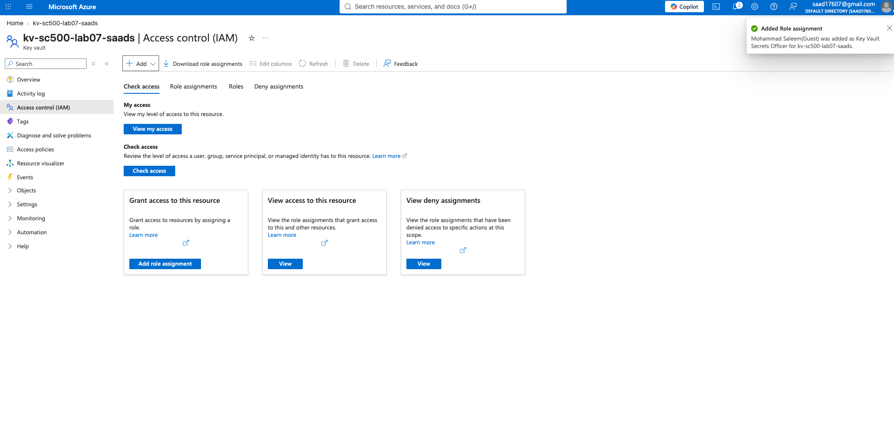
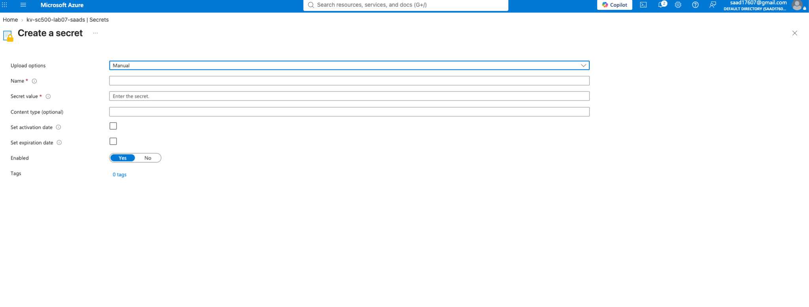
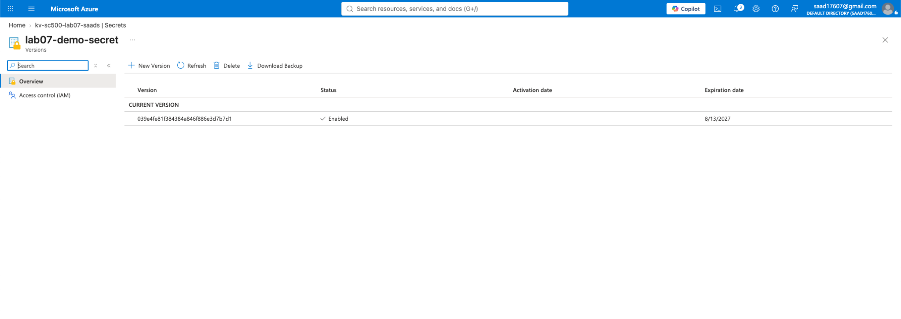
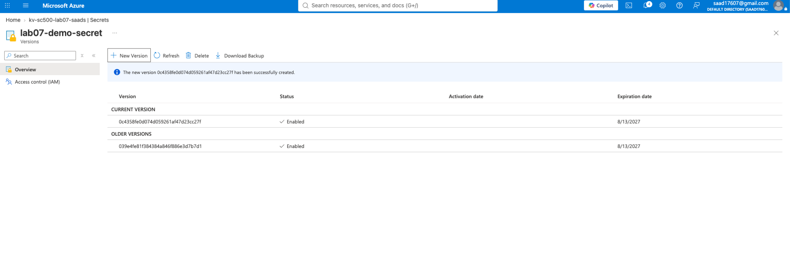
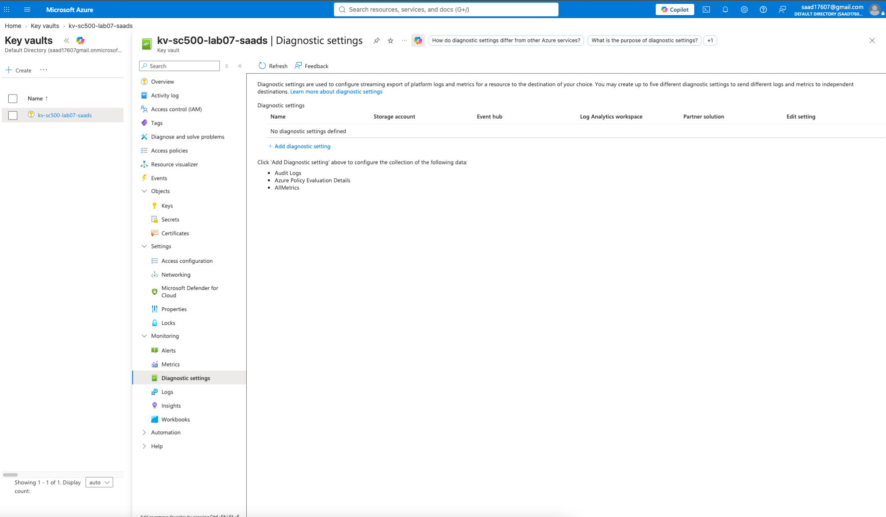
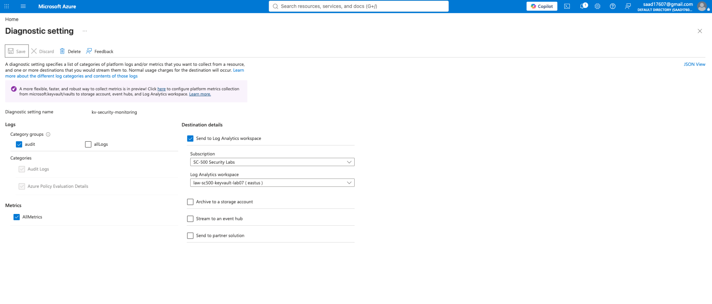
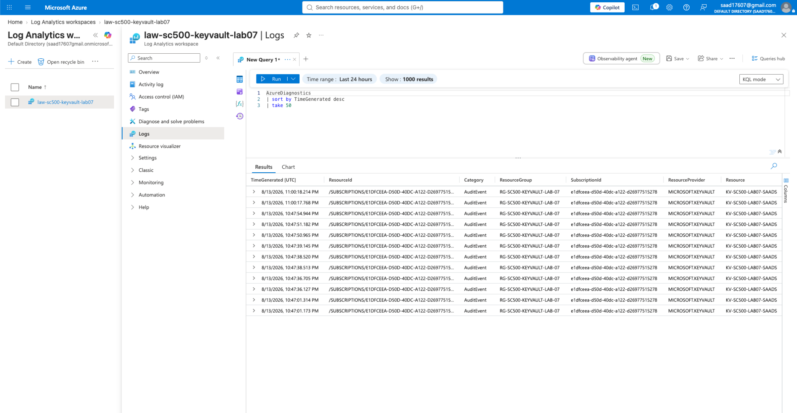
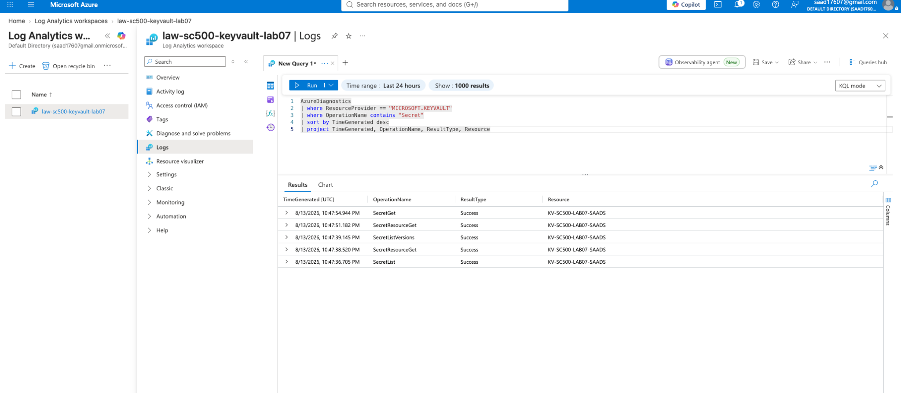

# SC-500 Lab 7: Azure Key Vault & Secrets Security

## Overview

This hands-on lab demonstrates the implementation of secure secrets management and security monitoring using **Azure Key Vault**.

The lab covers secret creation, credential rotation and versioning, disabling obsolete secret versions, Key Vault network security, diagnostic logging, centralized monitoring with Azure Log Analytics, and investigation of secret-access activity using **Kusto Query Language (KQL)**.

---

## Objectives

- Deploy and configure Azure Key Vault
- Securely store application credentials as Key Vault secrets
- Implement secret expiration and credential rotation
- Manage multiple secret versions
- Disable obsolete credential versions
- Review Key Vault network security controls
- Configure Key Vault diagnostic logging
- Forward audit events to Azure Log Analytics
- Query Key Vault activity using KQL
- Detect and investigate secret retrieval activity

---

## Technologies Used

- Microsoft Azure
- Azure Key Vault
- Azure Monitor
- Azure Log Analytics
- Azure Diagnostic Settings
- Kusto Query Language (KQL)
- Azure IAM / RBAC

---

## 1. Azure Key Vault Deployment

An Azure Key Vault was deployed to provide centralized and secure storage for application secrets and credentials.

Using a dedicated secrets-management service reduces the risk associated with storing credentials directly within source code, scripts, or application configuration files.



---

## 2. Secure Secret Creation

A demonstration credential was securely stored within Azure Key Vault.

An expiration date was configured to demonstrate secret lifecycle management and reduce the risk associated with indefinitely valid credentials.



---

## 3. Secret Rotation & Version Management

A new version of the credential was created to simulate a real-world **secret rotation** process.

Azure Key Vault maintains individual versions of secrets, allowing credentials to be rotated while maintaining visibility into their lifecycle.



---

## 4. Disabling the Previous Secret Version

Following credential rotation, the previous secret version was disabled while the newly rotated version remained enabled.

This demonstrates an important security practice: obsolete credentials should be deactivated after successful rotation to reduce unnecessary exposure.



---

## 5. Key Vault Network Security

Key Vault networking controls were reviewed and configured to demonstrate how network-level restrictions can complement identity-based security.

Azure Key Vault can be configured to:

- Permit public network access
- Restrict access to selected networks and IP addresses
- Disable public network access
- Use private endpoint connectivity

These controls provide an additional security boundary around sensitive credentials.



---

## 6. Diagnostic Logging & Centralized Monitoring

Key Vault diagnostic settings were configured to forward security telemetry to an Azure Log Analytics workspace.

Audit logging provides visibility into operations performed against the vault and allows security teams to centrally investigate activity involving sensitive credentials.



---

## 7. Key Vault Audit Events

After diagnostic logging was enabled, Key Vault audit telemetry began appearing within the Log Analytics workspace.

The `AzureDiagnostics` table provided centralized visibility into Key Vault operations.



---

## 8. Detecting Secret Access with KQL

Kusto Query Language (KQL) was used to isolate operations involving Key Vault secrets.

```kusto
AzureDiagnostics
| where ResourceProvider == "MICROSOFT.KEYVAULT"
| where OperationName contains "Secret"
| sort by TimeGenerated desc
| project TimeGenerated, OperationName, ResultType, Resource
```

The query identified successful operations including:

- `SecretGet`
- `SecretResourceGet`
- `SecretListVersions`
- `SecretList`

The successful **`SecretGet`** event demonstrates that retrieval of a sensitive secret can be captured through Key Vault auditing and investigated through Log Analytics.



---

## Security Engineering Takeaways

This lab demonstrates that secure secrets management extends beyond simply storing credentials in a vault.

A defense-in-depth approach combines:

**Secret Management → Credential Rotation → Access Control → Network Security → Audit Logging → Centralized Monitoring → KQL Investigation**

With Key Vault diagnostic telemetry integrated into Log Analytics, security teams can investigate activities such as unauthorized secret retrieval attempts, credential enumeration, unexpected administrative changes, and abnormal access patterns.

---

## Skills Demonstrated

`Azure Key Vault` `Secrets Management` `Credential Rotation` `Azure RBAC` `Network Security` `Azure Monitor` `Log Analytics` `KQL` `Diagnostic Logging` `Cloud Security Monitoring`

---

## Lab Result

Successfully implemented an Azure Key Vault security workflow that included **secure credential storage, secret rotation, version management, network security controls, centralized audit logging, and KQL-based detection of secret access activity**.
