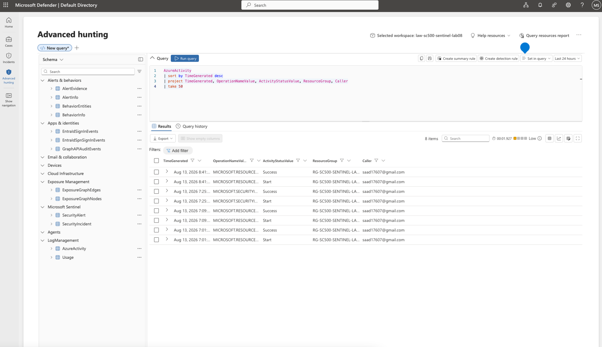
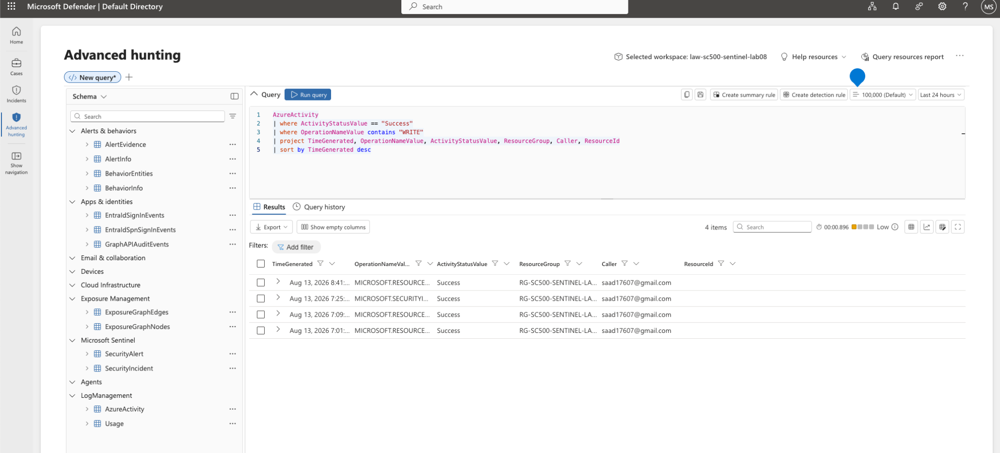
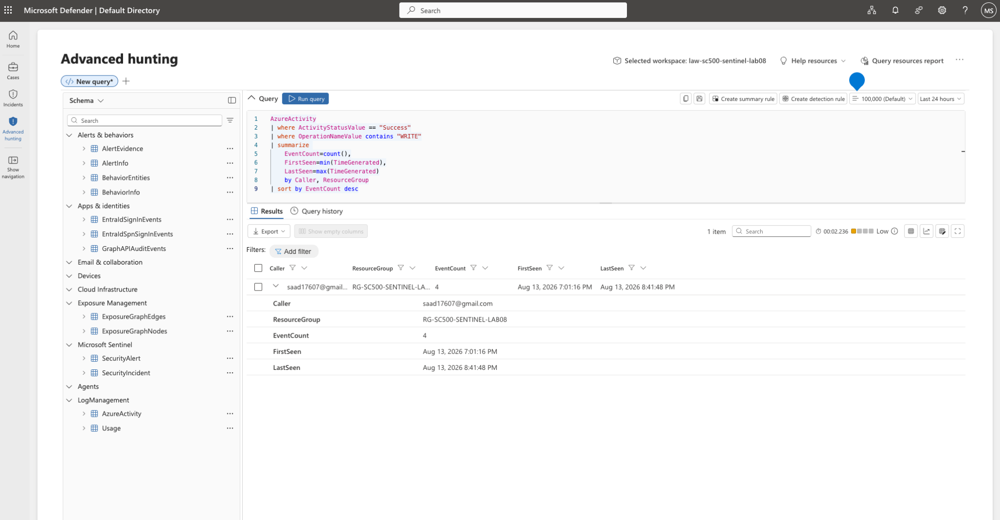
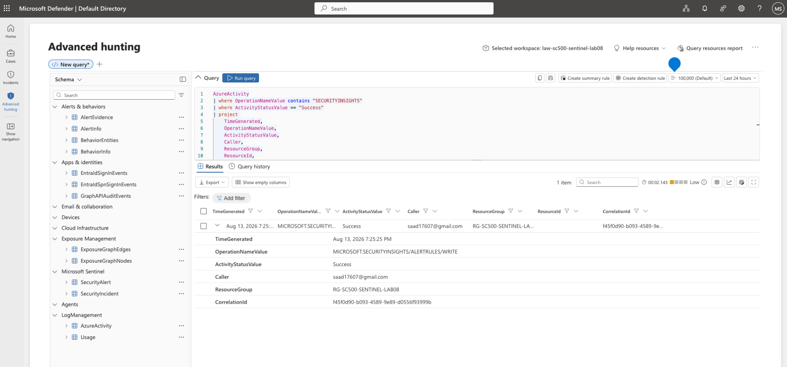

# Lab 09 - Microsoft Sentinel Threat Hunting

## Overview

This lab demonstrates Microsoft Sentinel threat hunting using Kusto Query Language (KQL) to analyze Azure Activity Logs, identify administrative changes, and investigate Sentinel configuration modifications.

## Objectives

- Perform Azure activity log analysis using KQL
- Detect successful Azure resource modifications
- Identify administrative behavior patterns
- Investigate Microsoft Sentinel analytics rule changes
- Practice SOC-style threat hunting workflows

---

# Lab Environment

## Services Used

- Microsoft Sentinel
- Log Analytics Workspace
- Azure Activity Logs
- Kusto Query Language (KQL)

---

# Investigation 1 - Azure Activity Baseline Query

## Purpose

Reviewed Azure administrative activity to establish a baseline of recent activity within the environment.

## KQL Query

```kusto
AzureActivity
| sort by TimeGenerated desc
| project TimeGenerated, OperationNameValue, ActivityStatusValue, ResourceGroup, Caller
| take 50
```

## Results

The query returned Azure administrative events including resource modifications, Sentinel activity, and user actions.

Screenshot:



---

# Investigation 2 - Detect Successful Azure Resource Modifications

## Purpose

Identified successful WRITE operations against Azure resources that may represent administrative changes.

## KQL Query

```kusto
AzureActivity
| where ActivityStatusValue == "Success"
| where OperationNameValue contains "WRITE"
| project TimeGenerated, OperationNameValue, ActivityStatusValue, ResourceGroup, Caller, ResourceId
| sort by TimeGenerated desc
```

## Results

Detected successful resource modification activity performed within the Azure environment.

Screenshot:



---

# Investigation 3 - User Activity Aggregation

## Purpose

Aggregated administrative activity by user to identify behavior patterns.

## KQL Query

```kusto
AzureActivity
| where ActivityStatusValue == "Success"
| where OperationNameValue contains "WRITE"
| summarize 
    EventCount=count(),
    FirstSeen=min(TimeGenerated),
    LastSeen=max(TimeGenerated)
    by Caller, ResourceGroup
| sort by EventCount desc
```

## Results

The query identified modification activity counts and timestamps associated with administrative users.

Screenshot:



---

# Investigation 4 - Sentinel Analytics Rule Modification Detection

## Purpose

Detected changes made to Microsoft Sentinel analytics rules through Azure Activity Logs.

## KQL Query

```kusto
AzureActivity
| where OperationNameValue contains "SECURITYINSIGHTS"
| where ActivityStatusValue == "Success"
| project 
    TimeGenerated,
    OperationNameValue,
    ActivityStatusValue,
    Caller,
    ResourceGroup,
    ResourceId,
    CorrelationId
| sort by TimeGenerated desc
```

## Results

Successfully identified Microsoft Sentinel alert rule modifications.

Screenshot:



---

# Skills Demonstrated

- Microsoft Sentinel
- KQL Threat Hunting
- Azure Activity Log Investigation
- Cloud Security Monitoring
- Detection Engineering
- Security Operations Workflow
