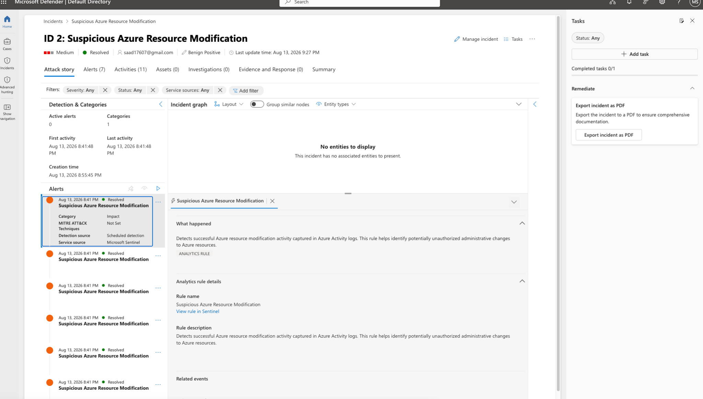

# Lab 10 – Microsoft Sentinel Incident Response

## Objective

The objective of this lab was to demonstrate an end-to-end Microsoft Sentinel incident response workflow. I generated authorized Azure resource modification activity, validated that the activity was detected by Microsoft Sentinel, investigated the resulting incident, and resolved the incident as a benign positive.

## Environment

- Microsoft Azure
- Microsoft Sentinel
- Microsoft Defender portal
- Azure Activity Logs
- Log Analytics Workspace
- Kusto Query Language (KQL)

## Scenario

A controlled resource modification was performed against an Azure resource group to simulate activity that could require security investigation.

Azure Activity Logs captured the modification and Microsoft Sentinel's scheduled analytics rule detected the activity, generating alerts and a security incident.

The incident was then investigated to determine whether the activity represented malicious behavior or authorized administrative activity.

## Investigation

During the investigation, I reviewed:

- Incident severity and status
- Associated Sentinel alerts
- Detection source
- Azure Activity Log events
- Operation details
- Resource group information
- Initiating user
- Activity status
- Related event information

The investigation confirmed that the resource modification was generated by my authorized lab activity rather than malicious activity.

## Incident Resolution

After validating the activity, the Microsoft Sentinel incident was:

- Assigned for investigation
- Classified as **Benign Positive**
- Marked as **Resolved**

This demonstrates the full incident lifecycle from detection through analyst triage and final disposition.

## Evidence

### Incident Resolved as Benign Positive

The screenshot above demonstrates the completed incident response workflow. Microsoft Sentinel shows the incident as **Resolved** and classified as a **Benign Positive** after investigation of the Azure resource modification activity.

## Skills Demonstrated

- Microsoft Sentinel
- Security incident investigation
- SIEM alert triage
- Azure Activity Log analysis
- Cloud security monitoring
- Incident classification
- Incident resolution
- KQL-based security analysis
- Security operations workflow

## Key Takeaway

This lab demonstrates an end-to-end cloud security incident response workflow:

**Azure Activity → Logging → Sentinel Detection → Alert → Incident → Investigation → Classification → Resolution**

Rather than simply generating an alert, the lab demonstrates how a security analyst can investigate the underlying activity, determine whether it represents a legitimate threat, document the findings, and properly close the incident.
