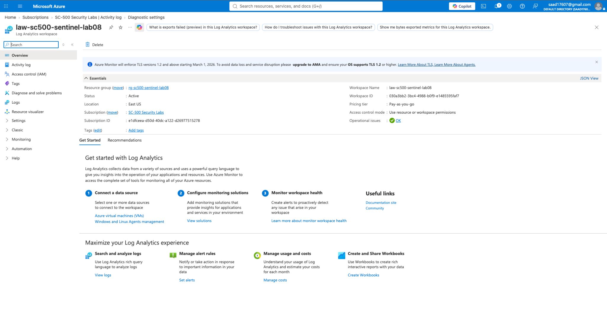
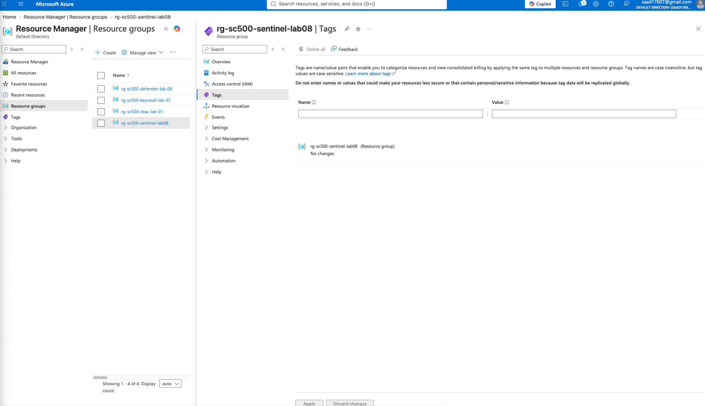
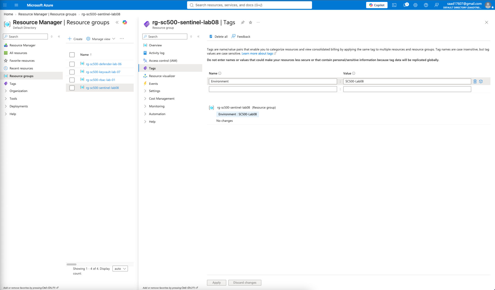
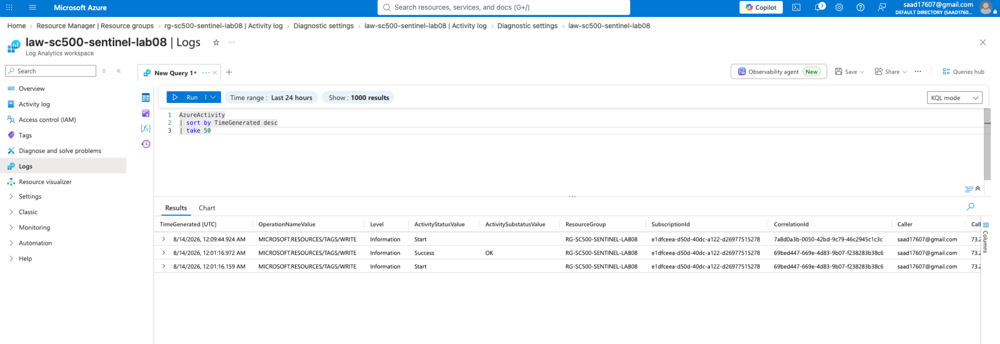
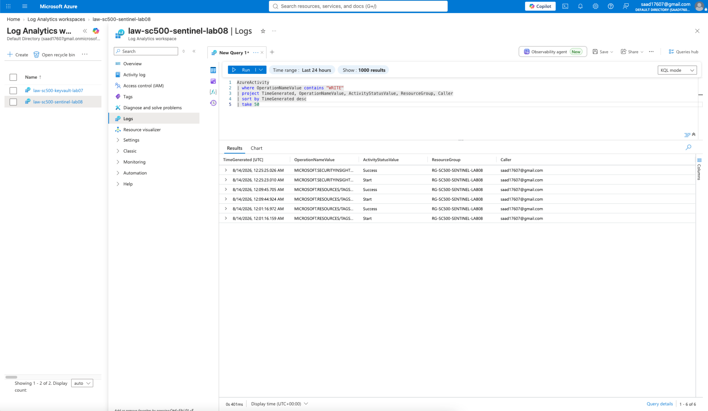
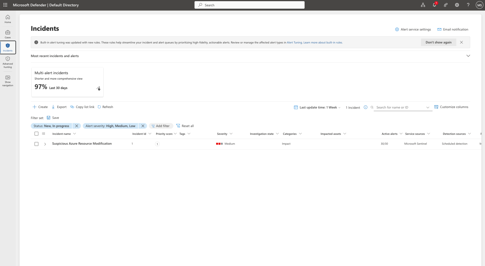
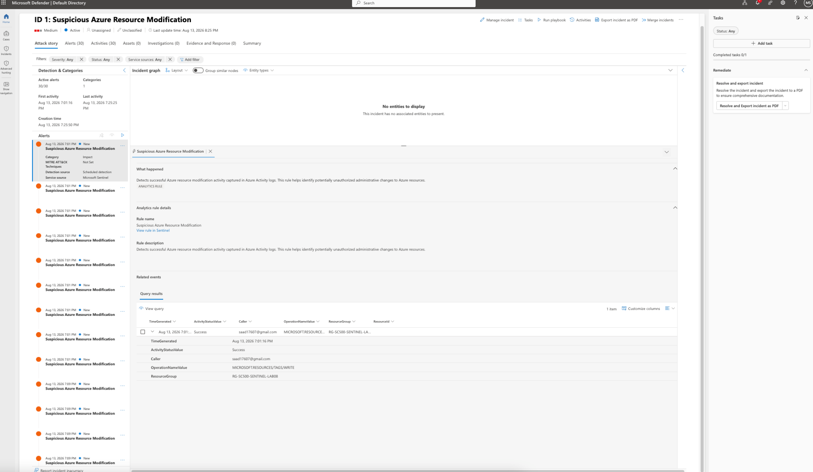
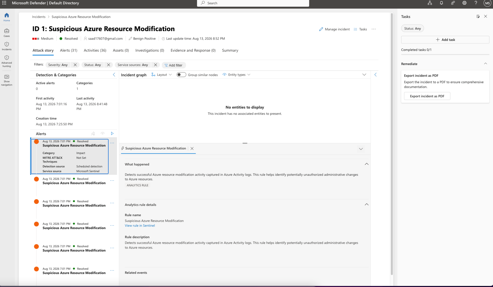

# Lab 08 – Microsoft Sentinel SIEM Threat Detection & Incident Response

## Objective

The objective of this lab was to configure Microsoft Sentinel as a cloud-native SIEM, ingest Azure Activity Logs into a Log Analytics workspace, analyze security events using Kusto Query Language (KQL), create a custom analytics rule, generate a security incident, investigate the detected activity, and resolve the incident after validating the activity as authorized.

This lab demonstrates an end-to-end security monitoring and incident response workflow using Microsoft Sentinel and Microsoft Defender.

---

## Technologies Used

- Microsoft Azure
- Microsoft Sentinel
- Microsoft Defender
- Azure Monitor
- Log Analytics Workspace
- Azure Activity Logs
- Kusto Query Language (KQL)
- MITRE ATT&CK

---

## Lab Architecture

The detection workflow implemented in this lab was:

**Azure Resource Activity → Azure Activity Logs → Diagnostic Settings → Log Analytics Workspace → Microsoft Sentinel → KQL Detection → Analytics Rule → Alert → Incident → Investigation → Resolution**

---

## 1. Configure the Log Analytics Workspace

A dedicated Log Analytics workspace was deployed for Microsoft Sentinel. This workspace serves as the centralized location for collecting and querying security telemetry.



---

## 2. Generate Azure Resource Activity

Tags were created and modified on the Lab 08 resource group to generate Azure management-plane activity.

These changes created `WRITE` operations that could later be detected through Azure Activity Logs.



---

## 3. Configure Diagnostic Settings

Azure diagnostic settings were configured to forward subscription-level Azure Activity Logs to the Lab 08 Log Analytics workspace.

Relevant log categories were enabled so administrative and security-related Azure operations could be centrally analyzed.



---

## 4. Send Azure Activity Logs to Log Analytics

The diagnostic configuration was validated to ensure Azure Activity Log telemetry was being routed into the Sentinel-connected Log Analytics workspace.


---

## 5. Validate Log Ingestion with KQL

Azure Activity Log ingestion was validated using Kusto Query Language.

A basic query confirmed that activity records were successfully reaching the workspace.

```kusto
AzureActivity
| sort by TimeGenerated desc
| take 50
```



---

## 6. Create a Microsoft Sentinel Analytics Rule

A custom scheduled analytics rule named:

**Suspicious Azure Resource Modification**

was created in Microsoft Sentinel.

The rule was configured with **Medium** severity and mapped to the **MITRE ATT&CK Impact** tactic.

Its purpose was to detect successful Azure resource modification activity that could represent unauthorized administrative changes.


---

## 7. Detect Azure WRITE Activity with KQL

The detection logic searched Azure Activity Logs for successful resource modification operations.

```kusto
AzureActivity
| where ActivityStatusValue == "Success"
| where OperationNameValue contains "WRITE"
| project TimeGenerated, OperationNameValue, ResourceGroup, Caller, ActivityStatusValue, ResourceId
```

The rule was configured to:

- Run every **5 minutes**
- Analyze the previous **1 hour** of activity
- Trigger when more than **0 results** were returned
- Generate an alert for each matching event
- Automatically create incidents

The query successfully detected Azure resource modification activity.



---

## 8. Generate a Microsoft Sentinel Incident

After the analytics rule detected matching activity, Microsoft Sentinel automatically generated an incident named:

**Suspicious Azure Resource Modification**

The incident was assigned **Medium** severity and categorized under the **Impact** tactic.



---

## 9. Investigate the Security Alert

The generated incident was investigated in Microsoft Defender.

The investigation confirmed that the analytics rule detected a successful Azure resource modification operation.

The alert provided important investigation context including:

- Time generated
- Activity status
- Caller
- Operation name
- Resource group
- Resource ID

This demonstrates how SIEM telemetry can be transformed into actionable security detections for SOC investigation.



---

## 10. Resolve and Classify the Incident

After reviewing the detected activity, the modification was confirmed to be authorized testing performed as part of the security lab.

The incident was therefore:

- Assigned for investigation
- Classified as **Benign Positive**
- Marked as **Resolved**
- Documented with investigation notes

This represents the final stage of the incident-response lifecycle: validating the alert, determining whether the activity was malicious, documenting the investigation, and closing the incident.



---

## Security Skills Demonstrated

This lab demonstrates hands-on experience with:

- SIEM deployment and configuration
- Microsoft Sentinel
- Microsoft Defender
- Azure Monitor diagnostic settings
- Centralized security log ingestion
- Azure Activity Logs
- Log Analytics
- KQL security queries
- Custom detection engineering
- Scheduled analytics rules
- MITRE ATT&CK mapping
- Security alert generation
- Incident creation
- SOC investigation workflows
- Alert triage
- Incident classification
- Benign-positive validation
- Incident remediation and closure

---

## Key Takeaways

This lab demonstrated the complete lifecycle of cloud security monitoring and detection.

Rather than simply enabling Microsoft Sentinel, the lab generated real Azure management-plane activity, ingested the telemetry into Log Analytics, queried the data using KQL, created custom detection logic, generated a Sentinel incident, investigated the resulting alert, and documented the final resolution.

The exercise demonstrates how Microsoft Sentinel can be used as a cloud-native SIEM to identify potentially unauthorized changes to Azure resources and provide security analysts with the telemetry required to investigate and respond to those events.

---

## Detection Query

```kusto
AzureActivity
| where ActivityStatusValue == "Success"
| where OperationNameValue contains "WRITE"
| project TimeGenerated, OperationNameValue, ResourceGroup, Caller, ActivityStatusValue, ResourceId
```

---

## Lab Outcome

**Status: Successfully Completed**

Microsoft Sentinel successfully detected Azure resource modification activity and generated a security incident from the custom analytics rule. The incident was investigated and ultimately classified as a benign positive after confirming that the resource modification was authorized lab activity.
